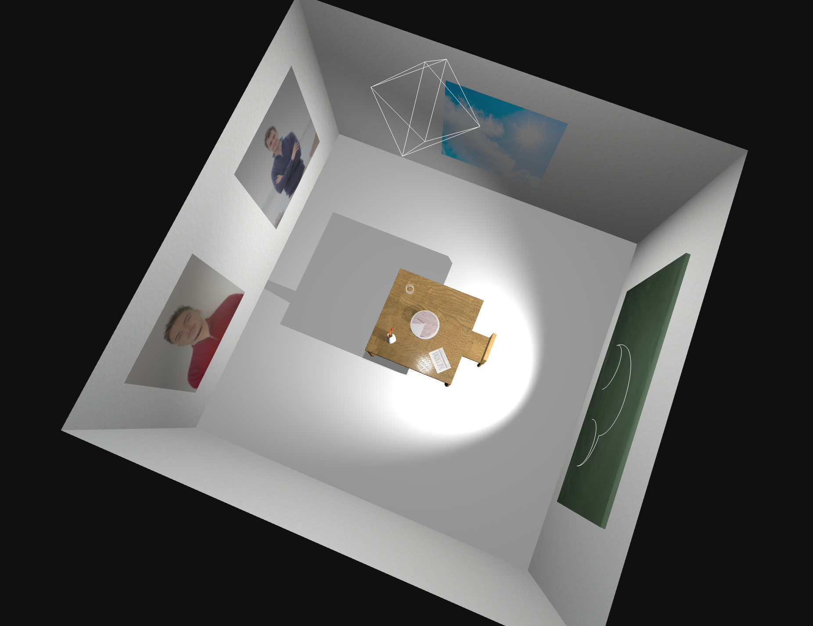

### README

As perguntas estão respondidas nos respetivos branches aula2, aula3 e aula4 na pasta tp1/README.md. Para aceder a cada uma das respostas basta fazer checkout para o branch respetivo.

#### Cena Final
