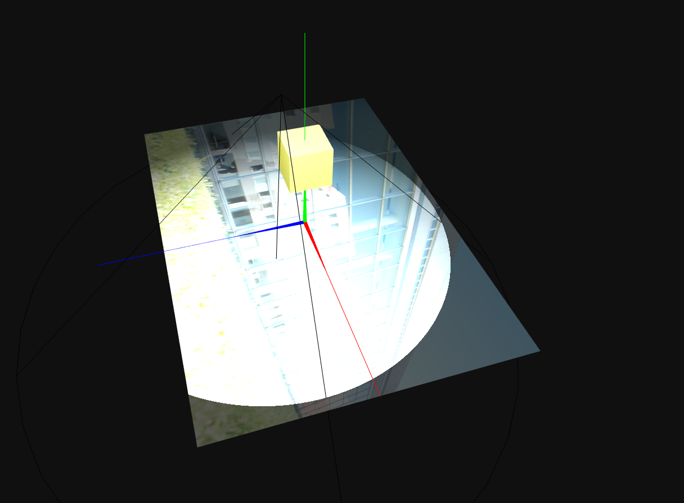

### Quadratic Bezier Curve

#### Corra o programa e verifique o resultado obtido; é desenhada a branco uma polyline constituída por dois segmentos de reta e três vértices. A que corresponde esta linha?
    Corresponde ao convex hull da curva de Bezier.

### Catmull Rom Curve

#### O que conclui sobre a influência ou não do número de pontos sobre o número de amostras?
    O número de pontos não influencia o número de amostras. O número de amostras determina a suavidade da representação da curva, independetemente do número de pontos.

### Superfícies Curvas

#### Faça variar o número de amostras, em ambas as direções; 3 … 4 … 6 … 8 … 12 … 16 … 24 … Consegue observar alterações?
    Não, não se observam alterações.

#### Análise de resultados. Qual é o grau em U? E em V? Corrija, em acordo, a declaração de this.orderU e this.orderV
    Como se pode ver na imagem, o grau em U ( curvas horizontais) é 2, pelo que a curva é parabólica. O grau em V (curvas verticais) é 1, pelo que a curva é linear.

#### Faça variar o número de amostras, em ambas as direções; 3 … 4 … 6 … 8 … 12 … 16 … 24 … Que alterações observa? Porquê a diferença de comportamento, se é que existe, para o caso da superfície retângulo plano?
    Ao variar o número de amostras, verifica-se que apenas a amostra U sofre alterações. Como a amostra V tem grau 1, trata-se de uma curva linear, pelo que variar o número de amostrar não vai provocar qualquer alteração visual. Já no caso da amostra U, como tem grau 2, trata-se de uma curva parabólica, pelo que ao variar o número de amostras, a curva vai ser mais ou menos suave, dependendo do número de amostras.

#### Aumente para 10 o peso do último ponto fornecido. Qual será o vértice afetado na superfície?
    Vértice superior direito.

