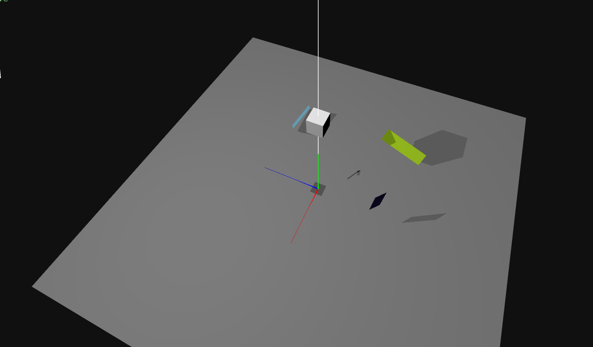

## TP4 Shadows

#### Ver as sombras resultantes e identificar as duas sombras produzidas pelo cubo: Relativa à fonte direcional;Relativa à fonte pontual.

   A sombra imediatamente abaixo do cubo é referente à fonte direcional. A sombra mais afastada do cubo é referente à fonte pontual.

#### Aumente para 100 o número de retângulos desenhados no volume mencionado.Comente a existência de sombras projetadas de uns retângulos nos outros.Comente a existência de sombras projetadas no chão pelos retângulos que se encontram entre ele e a fonte de luz.Comente a existência de sombra projetada pelo plane que representa o chão nos retângulos que se encontram abaixo do mesmo
    Como a propriedade castShadow está a true, os retângulos projetam sombras uns nos outros.
    Os retângulos projetam sombras no chão.
    Não existe sombra projetada pelo plane que representa o chão nos retângulos que se encontram abaixo do mesmo.

#### Inverta o sentido de rotação em x do plano, de forma a que a sua face visível fique orientada para baixo.Comente a visibilidade e a iluminação do chão.Comente novamente a existência de sombra projetada pelo plane nos retângulos inferiores.Que conclusão retira?
    O chão é visível do lado de baixo, porém não é iluminado, pelo que está totalmente preto.
    Neste caso, existe sombra projetada pelo plane nos retângulos inferiores, pelo que estão todos completamente pretos.

Como se pode ver, as normais apontam para baixo. Ora, no cálculo das sombras é tido em conta o sentido das normais, pelo que, neste caso, como as normais apontam para os retângulos abaixo do plano, este já projeta sombras nos retângulos inferiores.

#### Substitua o plano do chão por uma caixa com as mesmas dimensões x e z, mas muito fina em y (30 * 0.1 * 30).Reavaliando as sombras anteriores, fica o problema resolvido?
    Reavaliando as sombras anteriores, o problema fica resolvido.

#### Altere, na câmara da luz direcional, os valores shadow.camera.left / right / bottom / top para -3, 3, -3, 3 respetivamente. Que conclusão retira?
    As sombras projetadas são mais pequenas.

#### Altere agora, na mesma câmara, shadow.camera.far = 27. Que conclusão retira?
    Objetos mais afastados da fonte de luz não projetam sombras.

#### Faça o número de retângulos igual a 250 e verifique o valor de FPS
    O valor de FPS é de 60.
    
#### Com quantos polígonos o valor FPS cai para cerca de 40?
    Cerca de 3500 polígonos.

#### Com quantos polígonos o valor FPS cai para cerca de 20?
    Cerca de 8000 polígonos.

#### Faça o número de retângulos igual a 250 e verifique o valor de FPS
    O valor de FPS é de 60.

#### Com quantos polígonos o valor FPS cai para cerca de 40?
    Cerca de 2000 polígonos.

#### Com quantos polígonos o valor FPS cai para cerca de 20?
    Cerca de 5000 polígonos.