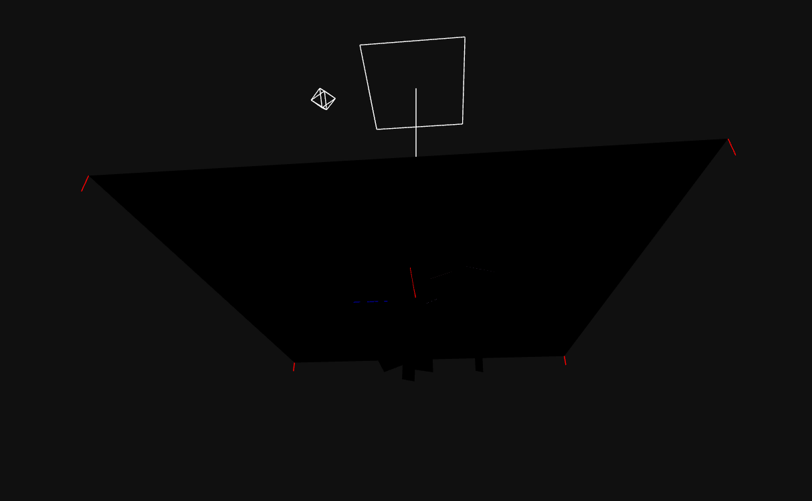

## TP1 Ilumination

### 0.1.1

#### Altere a posição da fonte de luz de para (0, 20, 0) para (0, -20, 0):
    Tanto o plano, como as faces laterais e superior do cubo ficaram mais escuras, uma vez que apenas estão iluminadas por uma luz ambiente.

#### Altere a intensidade da fonte de luz para 5 e a sua posição para (0, 2, 0); repita os pontos anteriores.
    O plano está pouco iluminado, relevando compoonente especular ao centro. As faces laterais e superior do cubo continuam escuras, uma vez que apenas estão iluminadas por uma luz ambiente. A fonte de luz mencionada no enunciado não ilumina o cubo.

#### Faça ```this.diffusePlaneColor = "rgb(0,0,0)``` Que componente(s) de iluminação encontra no plano?
    O plano apenas tem componente especular.

#### Faça também ```this.planeShininess = 400``` Que diferenças encontra? (experimente outros valores…)
    A intensidade da reflexão especular é proporcional a cos^n(α). Quanto maior o valor de n, mais concentrada é a reflexão especular.

#### Faça agora (note que há mais um parâmetro em PointLight): ```this.diffusePlaneColor =  "rgb(128,128,128)" this.specularPlaneColor = "rgb(0,0,0)" this.planeShininess = 0 pointLight = new THREE.PointLight(0xffffff, 5, 0, 0); pointLight.position.set( 0, 20, 0 )```; Veja e memorize o resultado

#### Faça agora: ```pointLight = new THREE.PointLight(0xffffff, 5, 15, 0)``` Comente sobre as alterações observadas.Reponha o penúltimo parâmetro em 0 (intensity) e faça variar o último parâmetro entre 0, 1 e 2 (decay); comente os resultados
    Como se alterou a distância máxima a que a luz chega, o plano ficou mais escuro.
    Quanto ao decay, nota-se a diminuição da intensidade da luminosidade que chega ao plano.

### 0.1.2
Posição (0,10,0)


#### Altere a posição da fonte de luz para (5, 10, 2). Comente sobre a nova iluminação obtida.
Nota-se maior iluminação na parte direita do plano.


#### Altere a posição da fonte de luz para (-5, 10, -2). Comente sobre a nova iluminação obtida.
Nota-se maior iluminação na parte esquerda do plano.


#### Consulte a documentação sobre o parâmetro ```.target``` desta classe e acrescente um target diferente do de default.
Target alterado para (2,2,2).


#### Fonte de Luz "Foco" - Compare, nas 3 faces iluminadas do cubo, as respectivas iluminações.
A face superior do cubo é a face mais iluminada. A face da direita é a segunda mais iluminada e a face da esquerda é a menos iluminada.


